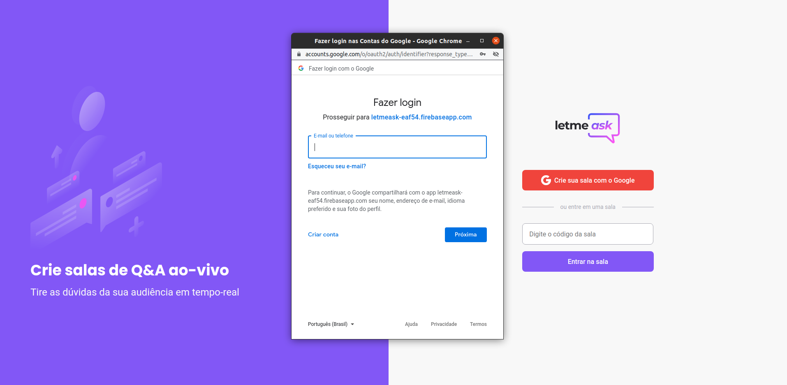
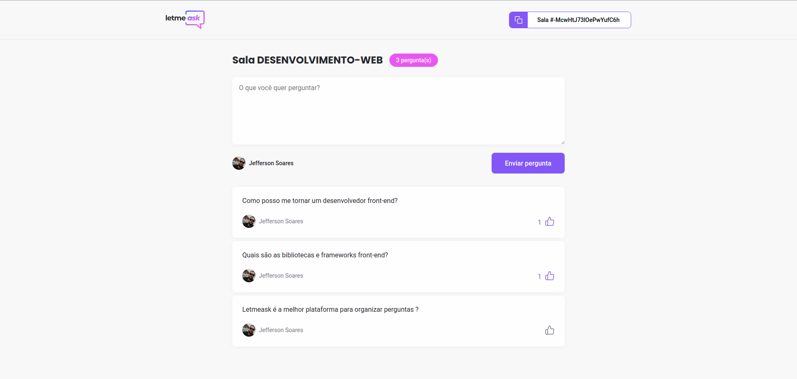
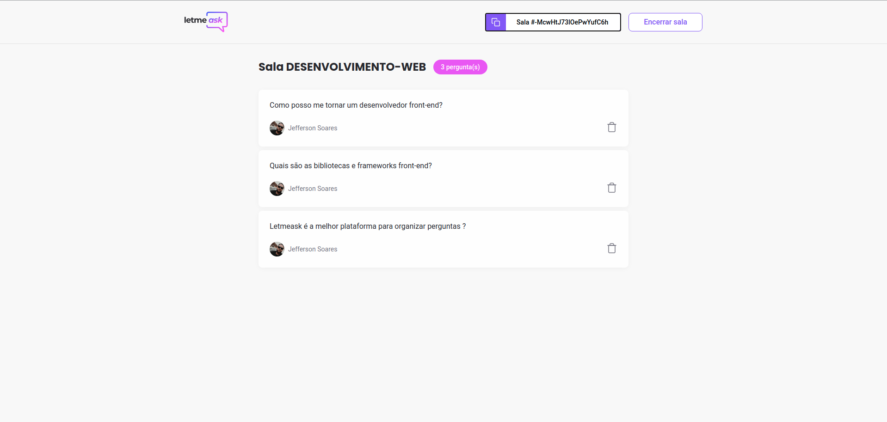

<div align="center">
  
  <p align="center">
    
    
    
  </p>
</div>

# :memo: About this project
Letmeask is a platform to organize questions, it has integration with realtime database and firebase authentication method, in this project several concepts and resources of the reactjs library were used, besides dependencies and interesting external libraries.
# :rocket: Main technologies
<ul>
  <li><a target="_blank" href="https://pt-br.reactjs.org/">reactjs</a></li>
  <li><a target="_blank" href="https://www.typescriptlang.org/docs/">typescript</a></li>
  <li><a target="_blank" href="https://firebase.google.com/">firebase</a></li>
  <li><a target="_blank" href="https://github.com/sass/sass">sass</a></li>
  <li><a target="_blank" href="https://react-hot-toast.com/">react-hot-toast</a></li>
  <li><a target="_blank" href="https://reactrouter.com/web/guides/quick-start">react-router-dom</a></li>
</ul>

# :cyclone: How to run this project
```bash
# Clone this repository
$ git clone https://github.com/jefferson1104/letmeask-reactjs.git

# Access directory project
$ cd letmeask-reactSJS
$ code . 

# Install project dependencies using yarn package manager
$ yarn

# Run this application
$ yarn start
```

# :bulb: Improvement Tips
- Make the project responsive
- Create a dark theme
- Use the [react-modal] library (https://github.com/reactjs/react-modal)

# 🎨 Screenshots
<p align="center">
  
  
  
  
  
  
</p>
