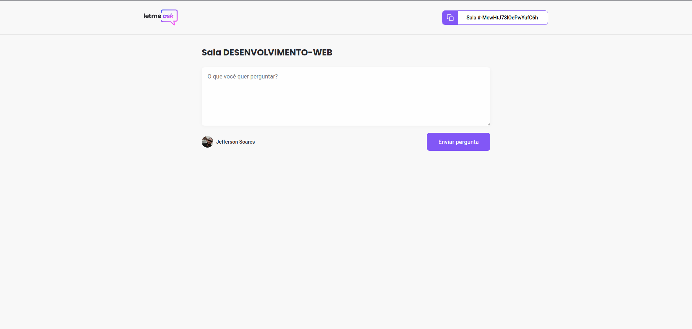

<h2 align="center">
  
</h2>

<p align="center">
  
  
  
</p>

##### :memo: Sobre o projeto

Letmeask é uma plataforma para organizar perguntas, possui integração com banco de dados realtime e método de autenticação do firebase, nesse projeto foi utilizado diversos conceitos e recursos da biblioteca reactjs alem de dependencias e bibliotecas externas interessantes.

##### :rocket: Principais tecnologias

<ul>
  <li><a target="_blank" href="https://pt-br.reactjs.org/">reactjs</a></li>
  <li><a target="_blank" href="https://www.typescriptlang.org/docs/">typescript</a></li>
  <li><a target="_blank" href="https://firebase.google.com/">firebase</a></li>
  <li><a target="_blank" href="https://github.com/sass/sass">sass</a></li>
  <li><a target="_blank" href="https://react-hot-toast.com/">react-hot-toast</a></li>
  <li><a target="_blank" href="https://reactrouter.com/web/guides/quick-start">react-router-dom</a></li>
</ul>

##### :cyclone: Como executar este projeto localmente?

```bash
# Clone este repositório
$ git clone https://github.com/jefferson1104/letmeask-reactSJS.git

# Acesse a paste do projeto
letmeask-reactSJS

# Instale as dependencias do projeto utilizando o gerenciado de pacotes yarn
$ yarn

# Execute o projeto localmente
$ yarn start

```

##### :bulb: Dicas de melhorias

- Deixar o projeto responsivo
- Criar um tema dark
- Utilizar a biblioteca [react-modal](https://github.com/reactjs/react-modal)

##### 🎨 Screenshots

<p align="center">
  
  
  
  
  
  
</p>
